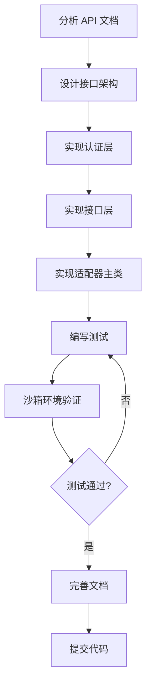

# KdGalaxyAdapter 开发指引

> 本文档面向开发者和 AI Agent，说明本项目的定位、作用及开发方法。

---

## 🏢 项目定位

### 所属体系

本项目是 **QDataV2 数据集成平台** 的官方适配器，隶属于 `qdatav2-server` 项目：

```
qdatav2-server/                              # 主项目根目录
├── apps/
│   ├── app_integration/                     # 应用集成模块
│   │   └── scaffold/                        # 适配器脚手架
│   │       └── templates/adapter/           # 适配器模板
│   │           └── kd-galaxy/   # ← 你在这里
│   │               ├── src/qdata_adapter_kd_galaxy/    # 适配器源码
│   │               ├── tests/               # 测试
│   │               └── api-docs/            # API 文档
│   └── app_integration_gateway/             # 集成网关
├── libs/
│   └── qdata_adapter/                       # 适配器 SDK（依赖）
└── docs/APP-INTEGRATION/                    # 集成开发文档
```

### 核心作用

KdGalaxyAdapter 是连接 **kd-galaxy** 平台与 QDataV2 数据集成平台的桥梁：

```
┌─────────────────────────────────────────────────────────────────┐
│                        QDataV2 平台                              │
│  ┌──────────────┐    ┌──────────────┐    ┌──────────────┐      │
│  │   数据流程    │───→│  转换节点    │───→│  数据目标    │      │
│  │   (Source)   │    │(Transformer) │    │  (Target)    │      │
│  └──────────────┘    └──────────────┘    └──────────────┘      │
│         ↑                                                       │
│         │ 通过 Adapter 连接                                      │
│         ↓                                                       │
│  ┌──────────────────────────────────────────────────────────┐  │
│  │           KdGalaxyAdapter                    │  │
│  │  ┌──────────────┐    ┌──────────────┐                   │  │
│  │  │   认证层      │    │   接口层     │                   │  │
│  │  │  (Auth)      │    │ (Interface)  │                   │  │
│  │  └──────────────┘    └──────────────┘                   │  │
│  └──────────────────────────────────────────────────────────┘  │
│         ↑                                                       │
│         │ HTTP/HTTPS                                             │
│         ↓                                                       │
│  ┌──────────────────────────────────────────────────────────┐  │
│  │              kd-galaxy 平台              │  │
│  │              (第三方 SaaS/ERP/电商平台)                     │  │
│  └──────────────────────────────────────────────────────────┘  │
└─────────────────────────────────────────────────────────────────┘
```

### 业务价值

- **数据同步**: 将 kd-galaxy 数据实时/定时同步到 QDataV2
- **数据写入**: 将 QDataV2 处理后的数据写回 kd-galaxy
- **流程触发**: 支持 kd-galaxy 事件触发 QDataV2 流程
- **统一抽象**: 为不同平台提供一致的 Pythonic API

---

## 🛠️ 技术栈

| 层级 | 技术 | 说明 |
|------|------|------|
| **SDK** | qdata-adapter | 轻易云官方适配器 SDK |
| **HTTP** | httpx | 异步 HTTP 客户端 |
| **认证** | 平台特定 | OAuth2 / API Key / HMAC |
| **测试** | pytest + pytest-asyncio | 异步测试框架 |
| **代码** | Python 3.11+ | 类型注解 + asyncio |

---

## 📁 项目结构

```
kd-galaxy/
├── src/qdata_adapter_kd_galaxy/           # 源码
│   ├── __init__.py              # 导出 KdGalaxyAdapter
│   ├── adapter.py               # 主适配器类
│   ├── exceptions.py            # 自定义异常
│   ├── auth.py                  # 认证处理
│   ├── constants.py             # 常量
│   ├── interfaces/              # 接口实现
│   │   ├── __init__.py
│   │   ├── base.py              # 接口基类
│   │   ├── standard.py       # 主接口
│   │
│   └── models/                  # 数据模型
│       └── __init__.py
├── tests/                       # 测试
│   ├── __init__.py
│   ├── conftest.py              # pytest fixtures
│   ├── test_adapter.py          # 适配器测试
│   ├── test_auth.py             # 认证测试
│   └── test_interfaces/         # 接口测试
├── api-docs/                    # API 文档
│   ├── README.md                # 文档索引
│   ├── apis_list.json           # 接口清单
│   └── scraped/                 # 爬取的文档
├── examples/                    # 示例代码
│   └── quickstart.py            # 快速开始
├── docs/                        # 开发文档
│   └── prompt.md                # AI 开发提示词
├── .env.example                 # 环境变量模板
├── pyproject.toml               # 项目配置
└── README.md                    # 项目说明
```

---

## 🚀 快速开始

### 1. 环境准备

```bash
# 进入项目目录
cd /path/to/qdatav2-server/apps/app_integration/scaffold/templates/adapter/kd-galaxy

# 创建虚拟环境
python -m venv .venv
source .venv/bin/activate  # Windows: .venv\Scripts\activate

# 安装依赖
pip install -e ".[dev]"
```

### 2. 配置环境

```bash
# 复制环境变量模板
cp .env.example .env

# 编辑 .env 填入测试凭据
vim .env
```

### 3. 运行测试

```bash
# Mock 测试
make test

# 沙箱环境真实 API 测试
USE_REAL_API=true make test

# 代码检查
make check

# 代码格式化
make format
```

---

## 🏗️ 开发流程

### 标准开发流程



### 开发命令

```bash
# 运行特定测试
pytest tests/test_adapter.py -v

# 运行特定接口测试
pytest tests/test_interfaces/test_standard.py -v

# 带覆盖率
pytest --cov=qdata_adapter_kd_galaxy --cov-report=html

# 调试模式
pytest -s --log-cli-level=DEBUG tests/

# 录制 HTTP 流量
RECORD_HTTP_TRAFFIC=true pytest tests/ -v
```

---

## 🧩 核心概念

### 1. 适配器生命周期

```python
from qdata_adapter_kd_galaxy import KdGalaxyAdapter
from qdata_adapter import ConnectorContext

# 1. 创建上下文
context = ConnectorContext(
    connector_id="my-connector",
    app_software_code="kd_galaxy",
    base_url="https://api.example.com",
    auth_config={...},
    settings={"interface": "standard"}
)

# 2. 初始化适配器
adapter = KdGalaxyAdapter(context)

# 3. 测试连接
result = await adapter.test_connection()

# 4. 查询数据
async for item in adapter.list_objects("orders"):
    process(item)
```

### 2. 双接口架构


本适配器使用单接口模式，所有操作通过统一的 `standard` 接口完成。

### 3. 认证机制

根据平台 API 文档，可能支持以下认证方式：

- **OAuth2**: 客户端凭证模式，支持 Token 自动刷新
- **API Key**: 请求头传递 API Key 和 Secret
- **HMAC**: 请求签名验证
- **Session**: 用户名/密码获取 Session

---

## 🧪 测试策略

### 测试金字塔

```
        /\
       /  \
      / E2E \          # 端到端测试（沙箱环境）
     /--------\
    /          \
   / Integration \     # 集成测试（真实 API）
  /--------------\
 /                \
/    Unit Tests    \   # 单元测试（Mock）
/--------------------\
```

### 测试原则

1. **只读测试**: 严禁修改数据，仅查询操作
2. **环境隔离**: 沙箱/生产环境配置分离
3. **Mock 优先**: 默认 Mock，真实 API 需显式开启
4. **录制回放**: 支持 HTTP 流量录制用于调试

### 测试数据管理

```bash
# Mock 数据
tests/data/fixtures/
├── orders.json
├── products.json
└── users.json

# HTTP 录制（gitignore）
tests/data/recordings/
├── test_auth.yaml
└── test_list_objects.yaml
```

---

## 📚 相关文档

### 内部文档

| 文档 | 位置 | 说明 |
|------|------|------|
| API 文档 | `api-docs/README.md` | 接口清单和文档索引 |
| 快速开始 | `QUICKSTART.md` | 5 分钟上手指南 |
| 贡献指南 | `CONTRIBUTING.md` | 代码规范 |
| AI 提示词 | `docs/prompt.md` | 给 AI 的开发提示词 |

### 外部文档

| 文档 | 位置 | 说明 |
|------|------|------|
| 适配器规范 | `qdatav2-server/docs/APP-INTEGRATION/` | 官方开发规范 |
| SDK 文档 | `qdatav2-server/libs/qdata_adapter/` | qdata-adapter SDK |
| 网关文档 | `qdatav2-server/apps/app_integration_gateway/` | 集成网关说明 |

---

## 🐛 调试技巧

### 启用调试日志

```python
import logging
logging.basicConfig(level=logging.DEBUG)
```

### 录制 HTTP 流量

```bash
RECORD_HTTP_TRAFFIC=true pytest tests/test_adapter.py -v
# 录制文件保存在 tests/data/recordings/
```

### 使用 REPL 测试

```python
import asyncio
from qdata_adapter_kd_galaxy import KdGalaxyAdapter
from qdata_adapter import ConnectorContext

async def test():
    context = ConnectorContext(...)
    adapter = KdGalaxyAdapter(context)
    result = await adapter.test_connection()
    print(result)

asyncio.run(test())
```

---

## ✅ 发布检查清单

- [ ] 所有测试通过
- [ ] 代码覆盖率 >= 80%
- [ ] `make check` 无警告
- [ ] `make format` 无变更
- [ ] README 文档完整
- [ ] CHANGELOG 已更新
- [ ] 版本号已更新
- [ ] 示例代码可运行

---

## 📞 支持

### 项目维护

- **作者**: 广东轻亿云软件科技有限公司
- **邮箱**: opensource@qeasy.cloud
- **公司**: 广东轻亿云软件科技有限公司

### 相关项目

- **QDataV2**: https://www.qeasy.cloud
- **主项目**: `qdatav2-server`
- **SDK**: `libs/qdata_adapter`

---

## 📄 许可
本项目采用 **AGPL-3.0** 开源协议。

- 个人学习/研究：免费
- 商业用途：需购买商业许可
- 联系: vincent@qeasy.cloud

---

*本文档版本: 0.1.0*  
*最后更新: *